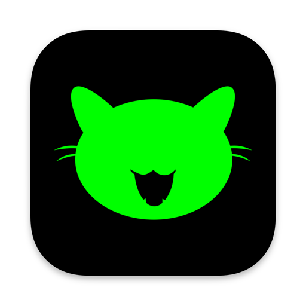

<p align="center">
  
</p>

<h1 align="center">PurrWallet</h1>

A Cashu ecash wallet built with Rust + Flutter, powered by [CDK (Cashu Development Kit)](https://github.com/cashubtc/cdk).

- **Cross-platform**
- **Local Wallet + NIP-60 Wallets**
- **Local/Tor mint support**
- **IRC Style**

## Roadmap

### Core Features - Completed
- [x] Local wallet implementation
- [x] Wallet creation
- [x] Send & receive ecash tokens
- [x] Deposit & withdraw (Lightning via melt)
- [x] QR code scanning
- [x] Access local mints

### Core Features - In Progress
- [ ] Tor mints support
- [ ] Melt quote verification
- [ ] Mint discovery
- [ ] Wallet recovery from seed
- [ ] P2PK (Pay-to-Public-Key) send support
- [ ] Check proofs validity
- [ ] Screen lock & biometric authentication (Face ID / Touch ID)

### Enhanced Features - Planned
- [ ] Multi-unit support (sat, usd, eur, etc.)
- [ ] Local notifications
- [ ] NWC (Nostr Wallet Connect) support
- [ ] Nostr account integration
- [ ] Share ecash to Nostr notes
- [ ] Send ecash to Nostr friends
- [ ] Theme customization
- [ ] Multi-language support
- [ ] NIP-60 wallet sync

### Platform Optimization - Planned
- [ ] Android tablet version
- [ ] iPad version
- [ ] Desktop UI improvements (macOS, Linux, Windows)

## Getting Started

### Installation

1. Clone the repository:
```bash
git clone https://github.com/heathermm55/purrwallet.git
cd purrwallet
```

2. Install Flutter dependencies:
```bash
flutter pub get
```

3. Run the app:
```bash
flutter run
```

## Contributing

Contributions are welcome! Please feel free to submit a Pull Request.

## License

This project is licensed under the MIT License - see the LICENSE file for details.

---

**⚠️ Warning**: This is beta software. Use at your own risk.
